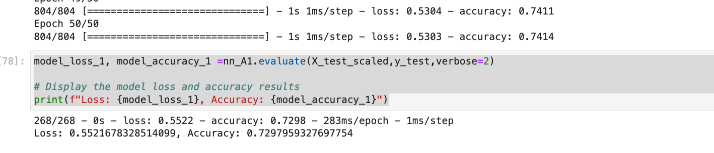
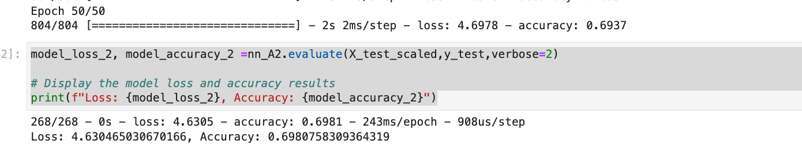

# HomeWork_Neural_Network

Pleaase find attached Neural_Network homework.

I was able to develop a model using the initial parameters however the accuracy was quite poor .   

  

I was then able to optimize the model by changing the activation function to "sigmoid" and adding one more hiden layer with significantly increased accuracy 

  

For the third model, i changed the activation function to "selu" However this was with reduced accuracy  

  