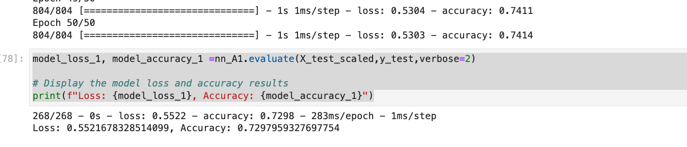
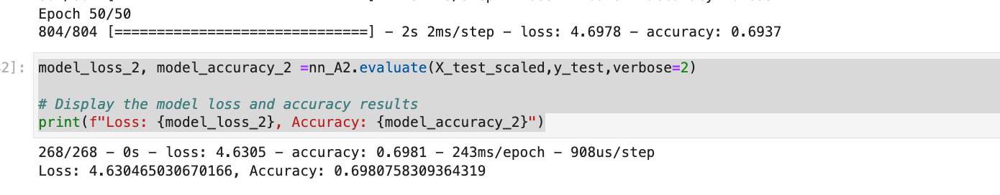
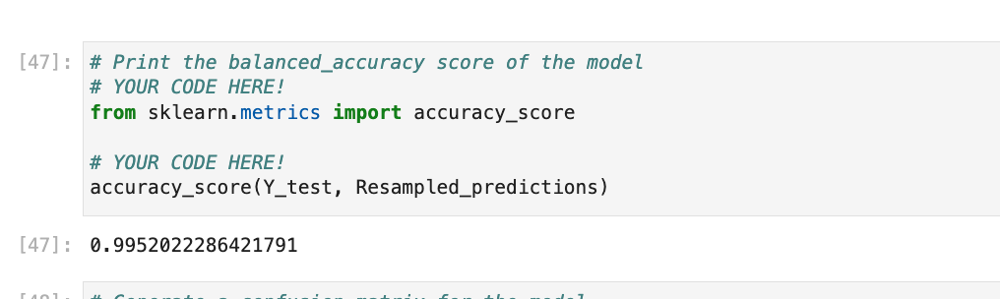
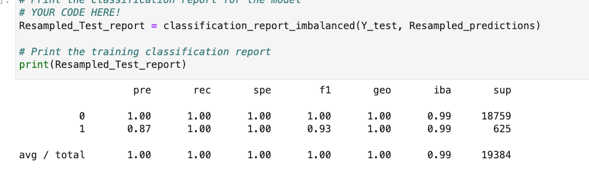

# Module 12 Report Template

## Overview of the Analysis

In this section, describe the analysis you completed for the machine learning models used in this Challenge. This might include:

* Explain the purpose of the analysis.
## This analysis uses a logistic regression model on an imbalanced lending data set. It them uses an oversampler to balance the data and runs the logistic regression on the resampled data.   
* Explain what financial information the data was on, and what you needed to predict.
## Financil data was lending data reviewing healthy loans and high risk  loans   
## Lending data had attributes such as loan size, interest rate, borrower income, debt to income ratio, number of accounts, derogratory marks, and total debt to predict loan statu   
* Provide basic information about the variables you were trying to predict (e.g., `value_counts`).
## lending data was quite inbalanced with 75,036 healthy loans and 500 high risk loans   
* Describe the stages of the machine learning process you went through as part of this analysis.
## lending data was split between Train and Test data set (75%, 25%)
## The model was initialized and trained on the training data set. 
## The model was then tested on the prediction was compared to existing test data y values   

* Briefly touch on any methods you used (e.g., `LogisticRegression`, or any resampling method).
## logistic regression and Oversampler was used.  

## Results

Using bulleted lists, describe the balanced accuracy scores and the precision and recall scores of all machine learning models.

* Machine Learning Model 1:
  * Description of Model 1 Accuracy, Precision, and Recall scores.
   

    

  * ## Accuracy on inbalanced data was 0.992
  * ## Precisison 1.0
  * ## Recall  0.89

* Machine Learning Model 2:
  * Description of Model 2 Accuracy, Precision, and Recall scores.
   

    

  * ## Accuracy on inbalanced data was 0.995
  * ## Precisison 1.0
  * ## Recall  1.0
## Summary

Summarize the results of the machine learning models, and include a recommendation on the model to use, if any. For example:
* Which one seems to perform best? How do you know it performs best?
## The resampled model performed better with a 100% recall accuracy 
